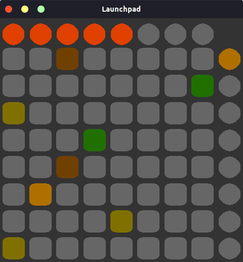

# Virtual Novation launchpad
Simple virtualization of Novation Launchpad MIDI controller.
Missing the top and right pads.



# COMPILE
```
make
```
# RUN
```
make run
```
# PLATFORMS
Tested only on Manjaro Linux. Should work on any platform.

# Third parties libraries
[RtMidi](https://github.com/thestk/rtmidi)<br/>
[SDL2](https://www.libsdl.org/)<br/>
[SDL2_gfx](https://sourceforge.net/projects/sdlgfx/)